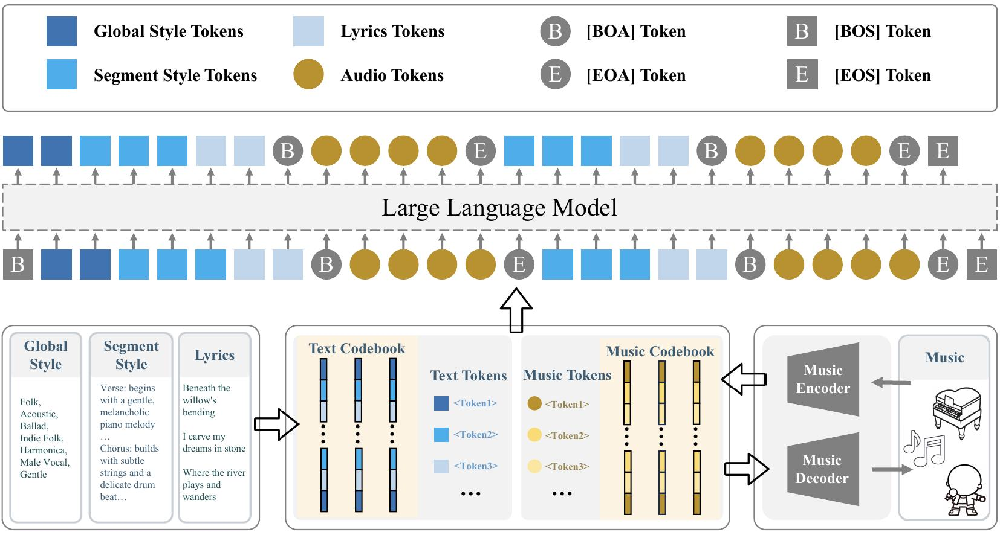

# Muse: Towards Reproducible Long-Form Song Generation with Fine-Grained Style Control

<p align="center">
  📄 <a href="https://arxiv.org/abs/2601.03973">Paper</a> • 📊 <a href="https://huggingface.co/datasets/bolshyC/Muse">Dataset</a> • 🤖 <a href="https://huggingface.co/bolshyC/models">Model</a> • 📚 <a href="#citation">Citation</a>
</p>

This repository is the official repository for "Muse: Towards Reproducible Long-Form Song Generation with Fine-Grained Style Control". In this repository, we provide the Muse model, training and inference scripts, pretrained checkpoints, and evaluation pipelines.

## News and Updates

* **2026.01.11 🔥**: We are excited to announce that all datasets and models are now fully open-sourced! 🎶 The complete training dataset (116k songs), pretrained model weights, training and evaluation code, and data pipeline are publicly available.

## Installation

To set up the environment for Muse:

- **For training**: Install the training framework:
  ```bash
  pip install ms-swift -U
  ```
- **For inference**: Install vLLM:
  ```bash
  pip install vllm
  ```
- **For audio encoding/decoding**: Some dependencies (e.g., `av`) require system-level packages. On Ubuntu/Debian, install them first:
  ```bash
  sudo apt-get update
  sudo apt-get install -y pkg-config libavformat-dev libavcodec-dev libavdevice-dev libavutil-dev libswscale-dev libswresample-dev libavfilter-dev
  ```
  We recommend creating a new conda environment with Python 3.10. **Note**: Since `omegaconf==2.0.5` is required and has compatibility issues with pip 24.1+, you need to downgrade pip first:
  ```bash
  pip install "pip<24.1"
  ```
  Then install dependencies:
  ```bash
  pip install -r requirements_mucodec.txt
  ```
  For more details, please refer to the [MuCodec](https://github.com/tencent-ailab/MuCodec) official repository.

## Repository Structure

This repository contains the following main directories:

- **`train/`**: Training scripts and utilities for fine-tuning the Muse model. See [`train/README.md`](train/README.md) for details.
- **`infer/`**: Inference scripts for generating music with the Muse model. See [`infer/README.md`](infer/README.md) for details.
- **`eval_pipeline/`**: Evaluation scripts for assessing model performance (Mulan-T, PER, AudioBox, SongEval, etc.).
- **`data_pipeline/`**: Scripts for building and processing training data, including lyrics generation, metadata processing, and music generation utilities.

## Model Architecture

<p align="center">
  
</p>

## Acknowledgments

We thank [Qwen3](https://github.com/QwenLM/Qwen3) for providing the base language model, [ms-swift](https://github.com/modelscope/ms-swift) for the training framework, and [MuCodec](https://github.com/tencent-ailab/MuCodec) for discrete audio tokenization.

## Citation

If you find our work useful, please cite our paper:

```bibtex
@article{jiang2026muse,
  title={Muse: Towards Reproducible Long-Form Song Generation with Fine-Grained Style Control},
  author={Jiang, Changhao and Chen, Jiahao and Xiang, Zhenghao and Yang, Zhixiong and Wang, Hanchen and Zhuang, Jiabao and Che, Xinmeng and Sun, Jiajun and Li, Hui and Cao, Yifei and others},
  journal={arXiv preprint arXiv:2601.03973},
  year={2026}
}
```
